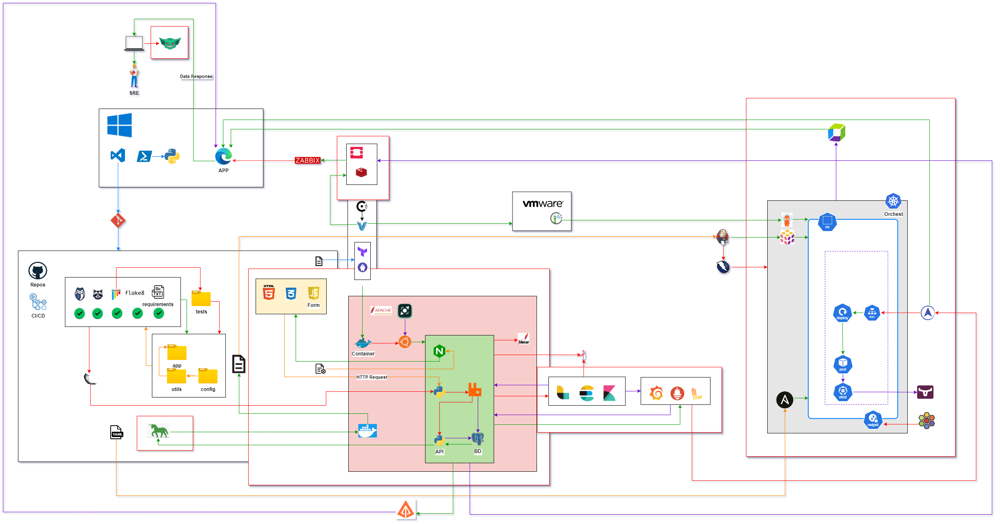

# 📋 CRUD Project with Frontend and Backend

This project implements a basic CRUD (Create, Read, Update, Delete) form for managing items. The Frontend is built using HTML, CSS, and JavaScript. The components are containerized in Docker and orchestrated with Docker Compose to facilitate deployment.

## 🗂️ Table of Contents

- [📋 CRUD Project with Frontend and Backend](#-crud-project-with-frontend-and-backend)
  - [🗂️ Table of Contents](#️-table-of-contents)
  - [📖 Project Description](#-project-description)
    - [🛑 Considerations](#-considerations)
    - [📂 Project Structure](#-project-structure)
  - [✅ Requirements](#-requirements)
  - [🔧 Installation and Setup](#-installation-and-setup)
  - [🚀 Running the Project](#-running-the-project)
  - [⚙️ CI/CD and Deployment on Render](#️-cicd-and-deployment-on-render)
    - [CI Pipeline](#ci-pipeline)
    - [🌐 Deployment on Render](#-deployment-on-render)
    - [How to run the pipeline locally](#how-to-run-the-pipeline-locally)
  - [🛠️ Technologies Used](#️-technologies-used)
  - [🏗️ Architecture](#️-architecture)
  - [🤝 Contributing](#-contributing)
  - [📜 License](#-license)

## 📖 Project Description

This project allows the management of items via a basic CRUD form, where you can:

- Add a new item.
- View a list of items.
- Edit an existing item.
- Delete an item.

The data can be stored in either a JSON file or a database.

### 🛑 Considerations

- **Security**: For this test, advanced security mechanisms such as authentication or thorough data validation have not been included.

- **Limits**: The storage is managed with SQLite, which is suitable for testing purposes but not recommended for production environments.

### 📂 Project Structure

```plaintext
.
├── docs/statics/
│   ├── index.html
│   ├── styles.css
│   └── script.js
├── docker-compose.yml
└── README.md

```

## ✅ Requirements

- 🐳 [Docker](https://www.docker.com/get-started)
- [Docker Compose](https://docs.docker.com/compose/)
- Git

## 🔧 Installation and Setup

1. Clone the frontend and backend repositories from GitHub:

    ```bash
    git clone https://github.com/omaciasd/frontend-crud.git

    ```

## 🚀 Running the Project

To start the complete application using Docker Compose:

1. Navigate to the folder where the `docker-compose.yml` file is located and run:

    ```bash
    docker-compose up

    ```

2. ## 🌐 Accessing the Application

- The **frontend** will be available by NGINX as inverse proxy [http://localhost:80](http://localhost:80).

## ⚙️ CI/CD and Deployment on Render

This project uses **GitHub Actions** for Continuous Integration (CI) and **Render** for Continuous Deployment (CD).

### CI Pipeline

Every time a *push* is made to the `main` branch, the following pipeline is triggered:

1. **Unit testing**: Automated tests are run to ensure code integrity.
2. **Docker image build**: Docker images for both frontend and backend are built.
3. **Render deployment**: If all steps pass successfully, the application is deployed to **Render**.

### 🌐 Deployment on Render

The project is configured to be deployed on **Render**, which provides a managed server infrastructure for both applications (frontend and backend).

- **Frontend** is deployed as a web service accessible at [https://frontend.render.com](https://frontend.render.com).

### How to run the pipeline locally

You can test the CI pipeline locally by running:

```bash
docker-compose up --build

```

## 🛠️ Technologies Used

- **Frontend**: HTML, CSS, JavaScript.
- **DevOps**: Docker, Docker Compose.
- **CI/CD**: GitHub Actions, Render.
- **🚧 TDD**: Postman, CURL.

## 🏗️ Architecture

The system consists of two services:

1. **📊 Frontend**: A simple user interface for CRUD operations that interacts with the backend.



## 🤝 Contributing

We welcome contributions! Please follow these steps:

1. Fork the repository.
2. Create a new branch (`git checkout -b feature/new-feature`).
3. Commit your changes (`git commit -am 'Add new feature'`).
4. Push to the branch (`git push origin feature/new-feature`).
5. Open a Pull Request.

## 📜 License

This project is licensed under the MIT License.
